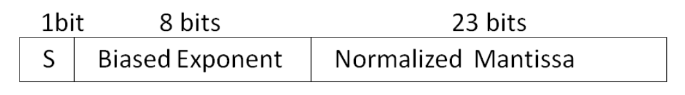
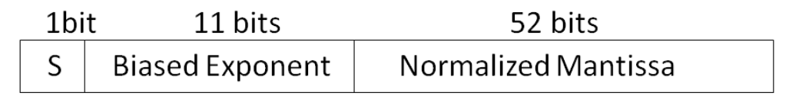

# Chapter 9: Floating Point Representation

_Originally created on 20 February, 2021 by Maxwell Hauser — Updated 7 October 2025._

_Builds upon material from Chapter 7: Signed Magnitude and Chapter 8: Binary Addition._

---

## Overview

A computer's Central Processing Unit (CPU) processes data in different formats. The two common numeric formats are **integers** and **floating point numbers**. Integers are whole numbers, while floating point numbers can represent real numbers, including fractions and very large or very small values.

---

## CPU Components

The CPU typically consists of several important components:

1. **ALU** (Arithmetic Logic Unit)
2. **FPU** (Floating Point Unit)
3. **Registers**
4. **Control Unit**
5. **Cache Memory**

**Component Descriptions:**

**1. ALU (Arithmetic Logic Unit)**

The **ALU** performs integer arithmetic operations such as addition, subtraction and bit or logic operations such as AND, OR, XOR, etc. Integers are whole numbers without fractional components. 1, 2, and 3 are integers, while 0.1, 2.2, and 3.0001 all have fractional components.

**2. FPU (Floating Point Unit)**

The **FPU** performs floating point operations. Floating point numbers have three components:
- **Sign bit:** Indicates positive or negative
- **Mantissa:** The significant digits
- **Exponent:** The power to which the base is raised

The IEEE (Institute of Electrical and Electronics Engineers) developed a standard to represent floating point numbers, referred to as **IEEE 754**. This standard defines the format for both single (32-bit) and double (64-bit) precision floating point numbers.

Decimal floating points are represented by:

$$M \times 10^E$$

where $M$ is the signed mantissa, and $E$ is the exponent.

    - For example, a number like $8.36 × 10^6$ or $8.36E6$ could typically be stored as a floating point number. The sign, $(+/-)$, exponent $(10^6 or E6)$, and mantissa $(8.36)$ are separately represented within the bits allotted to a floating point number. As an IEEE754 single precision (32-bit) floating point number, $8.36 × 10^6$ would be represented by:

        $(0S$ $10010101E$ $11111110010000010000000M)_2$.

    - In higher level programming languages, programmers must define how their variables are stored as the CPU handles floating point numbers and integers differently.

    - Many modern languages allow for the interaction of two different types of numeric representation (such as multiplying a floating point number by an integer) without much hassle, but you may still get unintended results due to the constriction of the number formats.

    - Example Java code:

        ```java
        int X = 3;
        float Y = 3.1;
        int Z = X * Y;
        ```
        - In this example, X is an integer, Y is a floating point number, and Z is an integer. The multiplication of X and Y results in a floating point value (9.3), but Z is defined as an integer. Depending on the programming language, this code may result in an error or unexpected behavior.

        - Technically, X * Y should equal 9.3. However, three problems may arise as a result of this bit of code:

            1. Not all languages allow an integer and a float to be directly multiplied.
        
            2. Languages that automatically convert the variables to make them compatible may not perform the operation as you’d expect (for example, both variables being multiplied as integers when expecting a floating point product from a floating point number and an integer).

            3. X * Y is technically a floating point value, and assigning it to an integer may cause an error or lose precision (z = 9, not 9.3).

**3. Registers**

Registers are small, high-speed storage locations within the CPU that hold data temporarily during processing. They can store both integer and floating point values, depending on the CPU architecture.

**4. Control Unit**

The Control Unit manages the execution of instructions within the CPU, coordinating between the ALU, FPU, registers, and memory.

**5. Cache Memory**

Cache Memory is a small, high-speed memory located close to the CPU that stores frequently accessed data and instructions to improve performance. It can store both integer and floating point data.

---

## IEEE 754 Single Precision Representation

Floating point numbers in single precision are represented by 32 bits as shown below:

> 

**Format:** 1 bit (sign) + 8 bits (exponent) + 23 bits (mantissa) = 32 bits total

**Components:**

1. **Sign bit ($S$):** Represents the sign of the mantissa
   - $S = 0$ means positive
   - $S = 1$ means negative

2. **Biased Exponent (8 bits):** The actual exponent + 127
   - Bias value: $(01111111)_2 = 127_{10}$
   - Allows representation of both positive and negative exponents as positive numbers
   - Actual exponent = Biased exponent - 127

3. **Normalized Mantissa (23 bits):** The fractional part after the implicit leading 1
   - Represented as $1.M$, where $M$ is the stored mantissa
   - Example: If $M = 00101$, then the mantissa is $1.00101$
   - The leading 1 is implicit (not stored) to save space

---

## Examples

**Example 1: Convert to Single Precision**

**Problem:** Represent $(-6.25)_{10}$ in IEEE 754 single precision floating point representation

**Solution:**

**Step 1:** Convert the number to binary

$$(-6.25)_{10} = (-110.01)_2$$

**Step 2:** Normalize the binary number

$$-110.01 = -1.1001 \times 2^2$$

**Step 3:** Determine the sign bit

Since the number is negative, the sign bit is $1$.

**Step 4:** Calculate the biased exponent

$$\text{Biased exponent} = \text{exponent} + 127 = 2 + 127 = 129$$

In binary, 129 is represented as $(10000001)_2$.

**Step 5:** Determine the normalized mantissa

The normalized mantissa is $1001$ (the bits after the binary point).

**Step 6:** Combine all parts

- Sign bit: $1$
- Biased exponent: $10000001$
- Normalized mantissa: $10010000000000000000000$

Therefore, the IEEE 754 single precision representation of $(-6.25)_{10}$ is:

$(1\,10000001\,10010000000000000000000)_2$

**Example 2:** Find normalized mantissa and biased exponent of $(111.0000111)_2$

$(111.0000111)_2$ can be written in the form of $1.110000111 \times 2^{10}$

Where:
- $M = 110000111$
- Biased Exponent = $10 + 01111111 = 10000001$

The representation of $(111.0000111)_2$ in single precision is:

$(0\,10000001\,11000011100000000000000)_2$

**Example 3:** Convert the following single precision floating point number to decimal:

$(1\,01111101\,11001000000000000000000)_2$

- $S = 1$ means mantissa is negative.
- Biased exponent = $01111101$
  - Exponent = $01111101 - 01111111 = -00000010$
  - Exponent = $-2$
- Normalized Mantissa = $11001000000000000000000$
  - Mantissa = $1.11001000000000000000000$

Decimal number = $(-1)^1 \times 1.11001 \times 2^{-2} = -0.4375$


---

## IEEE 754 Double Precision Representation

In order to increase the accuracy of a floating point number, IEEE 754 offers double precision represented by 64 bits as shown below:

> 

The double precision format uses:
- 1 bit for the sign
- 11 bits for the exponent
- 52 bits for the mantissa

This allows for a much larger range and greater precision compared to single precision.

**Biased Exponent:** Exponent + 1023 
Both single and double precision formats use a biased exponent to represent both positive and negative exponents. In double precision, the bias is 1023 (or 01111111111 in binary). This means that to find the actual exponent, you subtract 1023 from the stored exponent value. 
For example, if the stored exponent is 10000000010 (which is 1026 in decimal), the actual exponent would be 1026 - 1023 = 3.
The mantissa in double precision is also normalized, meaning it is represented as 1.M, where M is the fractional part. The leading 1 is implicit and not stored, allowing for greater precision in the stored bits.
The double precision format is particularly useful in scientific computing and applications requiring high numerical accuracy, as it can represent a wider range of values and reduce rounding errors compared to single precision. 


Example 1.19 :  Represent 5.75 in  IEEE 745 single precision
-15. 625 =  ( 1111.101)2
-1111.101 = - 1.11101101  * 211
S=1
Normalized Mantissa =0.11101101
Biased Exponent =   11 +01111111 = 10000010
IEEE745 single precision is
1   10000010   1110110100000000000000

Example 1.20: Represent $(-0.15625)_{10}$ in IEEE 754 double precision
Step 1:  Convert the number to binary
(-0.15625)10 = (-0.00101)2

Step 2:  Normalize the binary number
-0.00101 = -1.01 × 2^-3

Step 3:  Determine the sign bit
Since the number is negative, the sign bit is 1.

Step 4:  Calculate the biased exponent
Biased exponent = exponent + 1023 = -3 + 1023 = 1020
In binary, 1020 is represented as $(01111111100)_2$.

Step 5:  Determine the normalized mantissa
The normalized mantissa is 010 (the bits after the binary point).

Step 6:  Combine all parts
The final representation is:
Sign bit: 1
Biased exponent: 01111111100
Normalized mantissa: 0100000000000000000000000000000000000000000000000000

Therefore, the IEEE 754 double precision representation of $(-0.15625)_{10}$ is:
(1 01111111100 0100000000000000000000000000000000000000000000000000)2
Example 1.21: Convert the following double precision floating point number to decimal:

    (0S 10000000010E  1011000000000000000000000000000000000000000000000000)2
    - S = 0 means mantissa is positive.

    - Biased exponent = 10000000010

        Exponent = 10000000010 - 01111111111 = 00000000011

        Exponent = 3

    - Normalized Mantissa = 1011000000000000000000000000000000000000000000000000000000
        Mantissa = 1.10110000000000000000000000000000000000000000000000000000
Decimal number = (-1)^0 × 1.1011 × 2^3 = 13.75

## Summary
1. The CPU processes data in different formats, including integers and floating point numbers.
2. The ALU performs integer arithmetic and logic operations, while the FPU handles floating point operations.
3. Floating point numbers are represented using the IEEE 754 standard, which includes single (32-bit) and double (64-bit) precision formats.
4. Single precision uses 1 bit for the sign, 8 bits for the exponent, and 23 bits for the mantissa, while double precision uses 1 bit for the sign, 11 bits for the exponent, and 52 bits for the mantissa.
5. The biased exponent allows for the representation of both positive and negative exponents.
6. Normalized mantissa ensures that the leading digit is always 1, maximizing the precision of the stored value.
